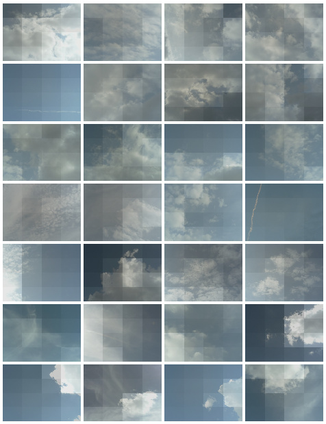

# Skies

A phoenix app, allows me to live-test Imago [(link)](https://github.com/lucassifoni/imago).
I'd like to grow it to sky classification & cloud shape sorting. It will drive the features added to Imago.
The pictures shown below come from a three-year live capture done for [A + B designers](https://aplusbdesigners.com), where their homepage hade a live view of the skies above them.

On the picture below, images are overlaid with their 4*4 luminance map.  


### Dependencies
- An elixir toolchain
- A Rust toolchain (cargo, namely)

### Install

```bash
$ git clone <repo>
$ mix deps.get
$ cd assets && npm install
```

### Run
Please provide a `SKY_PATH` environment variable, like `SKY_PATH=/path/to/pictures` or edit `start.sh` with your own path. 
